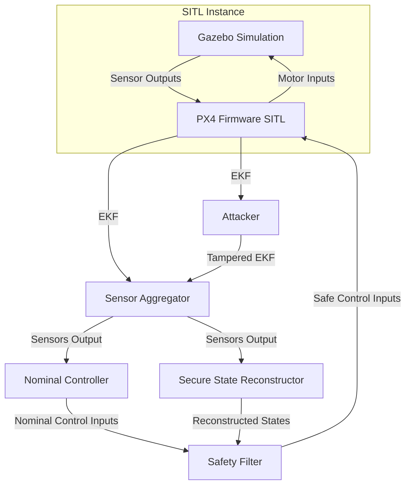
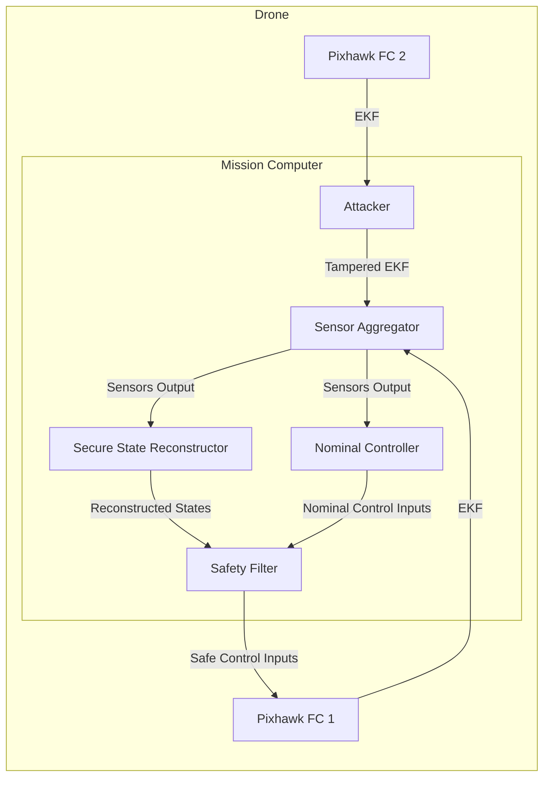

<!--toc:start-->
- [Installation](#installation)
  - [Pre-requisites](#pre-requisites)
  - [Containerised Deployement](#containerised-deployement)
    - [Simulation Environment](#simulation-environment)
    - [MicroXRCE-DDS Agent](#microxrce-dds-agent)
    - [ROS 2 Development Environment](#ros-2-development-environment)
  - [Native Deployment (WIP | SKIP FOR NOW)](#native-deployment-wip-skip-for-now)
- [Running (in Containers)](#running-in-containers)
  - [Launch Simulation](#launch-simulation)
  - [Launch DDS Agent](#launch-dds-agent)
  - [Launch Offboard Control Modules](#launch-offboard-control-modules)
  - [Launch Secure State Reconstruction Nodes](#launch-secure-state-reconstruction-nodes)
  - [Initiate the Estimator](#initiate-the-estimator)
- [Updating (in Containers)](#updating-in-containers)
- [Plan for Implementation](#plan-for-implementation)
  - [Simulation](#simulation)
  - [Hardware](#hardware)
<!--toc:end-->

# Installation

## Pre-requisites

- ROS 2 Humble Hawksbill
- PX4-Autopilot (and dependencies)

*OR* Just Docker

## Containerised Deployement

For this, we will be defining a few aliases. So do not forget to clean your
`.bashrc` file later on if you want to clean your aliases.

### Simulation Environment

First we need to install the autopilot firmware at the correct version.

```bash
# Clone the PX4-Autopilot Firmware
git clone --recursive -b release/1.14 https://www.github.com/PX4/PX4-Autopilot.git
cd PX4-Autopilot

# Add this directory for use later
echo "export FIRMWARE_DIR=$(pwd)" >> ~/.bashrc
source ~/.bashrc
# Confirm that the variable is stored by running
# echo $FIRMWARE_DIR
```

To launch the simulation environment. First run:

```bash
# Run once to ensure that any remote client (like the container)
# to connect to the X Server. Essentially allows you to run GUI
# apps launched in the container to be forwarded to your local system
xhost +
```

Next, we can enter the simulation docker environment:

```bash
# To launch a SITL with Gazebo-Garden GUI run this first ONCE:
docker run -it --privileged --rm \
    -v ${FIRMWARE_DIR}:/Firmware:rw \
    -v /tmp/.X11-unix:/tmp/.X11-unix:ro \
    -e DISPLAY=${DISPLAY} \
    -e LOCAL_USER_ID="$(id -u)" \
    -w /Firmware \
    --network=host  \
    --name=px4_sim px4io/px4-dev-simulation-jammy \
    /bin/bash
```

Once we enter the simulation environment, launch the simulation by running:

```bash
# Run this once you are inside the Docker container
make px4_sitl gz_x500
```

To make our life easier, we can make the `docker run` command into an alias:

```bash
echo 'alias px4_sim="docker run -it --privileged --rm -v ${FIRMWARE_DIR}:/Firmware:rw -v /tmp/.X11-unix:/tmp/.X11-unix:ro -e DISPLAY=${DISPLAY} -e LOCAL_USER_ID='$(id -u)' -w /Firmware --network=host --name=px4_sim px4io/px4-dev-simulation-jammy /bin/bash"' >> ~/.bashrc
```

Now, you can directly enter the simulation container environment by running
`px4_sim`.

### MicroXRCE-DDS Agent

The DDS agent is necessary to transfer the uORB topics from within the
autopilot into ROS 2 topics. This can also be deployed in container
environment:

```bash
git clone https://github.com/eProsima/Micro-XRCE-DDS-Agent.git
cd Micro-XRCE-DDS-Agent
docker build -t=microxrce_agent .
```

The build should take some time, but once it is done, we will have the agent
container available. To launch this:

```bash
docker run -it --rm --network=host microxrce_agent udp4 --port 8888
```

### ROS 2 Development Environment

For ease of use, just copy paste the following bash command as is. There aren't
any superuser commands so your system should be safe.

```bash
# First clone the repository
mkdir ~/ros_workspace && cd ~/ros_workspace
git clone --recursive https://github.com/juniorsundar-tii/px4-secure-state-reconstruction.git src

# Build the Docker image
cd src
docker build -t=ssr_ros_ws .

# Run the temp_container instance to copy out the build and install files
# This needs to be done ONCE
docker run -it --name=temp_container ssr_ros_ws /bin/bash &
cd ~/ros_workspace
rm -rf install build log
docker cp temp_container:/ros_workspace/install install
docker cp temp_container:/ros_workspace/log log
docker cp temp_container:/ros_workspace/build build
docker rm temp_container
```

To make it easier for us to develop the solution while testing it, we will
mount the ROS 2 workspace as a volume into the container. This way, you can
develop locally, but build, deploy and test into the container environment
where your ROS packages are available.

Since we will be using the container environment regularly, it is HIGHLY
RECOMMENDED to write this alias:

```bash
# Copy paste as it is
echo "alias ssr_ros_ws='docker run -it --network=host --ipc=host --pid=host --env UID=\$(id -u) --env GID=\$(id -g) -v /tmp/.X11-unix:/tmp/.X11-unix:ro -e DISPLAY=\${DISPLAY} -v ~/ros_workspace:/ros_workspace:rw -w /ros_workspace ssr_ros_ws'" >> ~/.bashrc

source ~/.bashrc

# Note that if you are planning to run GUI packages, preface any command in a terminal with
xhost +
```

We need to first build the workspace:

```bash
# You can now run all ROS 2 commands as long as you prefix it with our docker alias
ssr_ros_ws colcon build
```

## Native Deployment (WIP | SKIP FOR NOW)

Create a ROS 2 Workspace

```bash
mkdir ros2_ws && cd ros2_ws
```

Clone and build the workspace

```bash
git clone --recursive https://github.com/juniorsundar-tii/px4-secure-state-reconstruction.git src
rosdep install --from-paths src --ignore-src -r -y
colcon build
source install/local_setup.bash
```

# Running (in Containers)

To run everything we need commands in five (5) terminals:

1. Running the simulation environment
2. Running the MicroXRCEAgent *(Run once and forget)*
3. Running the offboard control modules
4. Run the secure state reconstruction node
5. Trigger the secure state reconstruction

This will be streamlined later on, but for now please bear with it.

## Launch Simulation

```bash
# in Terminal 1
px4_sim
# Once you enter the container
make px4_sitl gz_x500
```

## Launch DDS Agent

```bash
# in Terminal 2
docker run -it --rm --network=host microxrce_agent udp4 --port 8888
# Can run this and forget it
```

## Launch Offboard Control Modules

```bash
# in Terminal 3
ssr_ros_ws ros2 launch px4_offboard_control module_launch.py
```

If successful, then the drone should be hovering in the Gazebo simulation
environment.

## Launch Secure State Reconstruction Nodes

```bash
# in Terminal 4
ssr_ros_ws ros2 launch px4_ssr ssr_launch.py # This will launch the estimator and filter
```

## Initiate the Estimator

```bash
# in Terminal 5
ssr_ros_ws ros2 topic pub -1 /start_ssr std_msgs/msg/Empty "{}"
```

# Updating (in Containers)

As long as the `build`, `install` and `log` directories haven't been
tampered with, you can simply `git pull` or `git push` normally.

> [!warning]
> If something breaks and you are getting irreparable errors, then make sure
> to `commit` and `push` your changes to the repository. Delete the entire
> `~/ros_workspace` and re-run:
>
> ```bash
> # First clone the repository
> mkdir ~/ros_workspace && cd ~/ros_workspace
> git clone --recursive https://github.com/juniorsundar-tii/px4-secure-state-reconstruction.git src
> 
> # Build the Docker image
> cd src
> docker build -t=ssr_ros_ws .
> 
> # Run the temp_container instance to copy out the build and install files
> # This needs to be done ONCE
> docker run -it --name=temp_container ssr_ros_ws /bin/bash &
> cd ~/ros_workspace
> rm -rf install build log
> docker cp temp_container:/ros_workspace/install install
> docker cp temp_container:/ros_workspace/log log
> docker cp temp_container:/ros_workspace/build build
> docker rm temp_container
> ```

# Plan for Implementation

## Simulation




## Hardware


